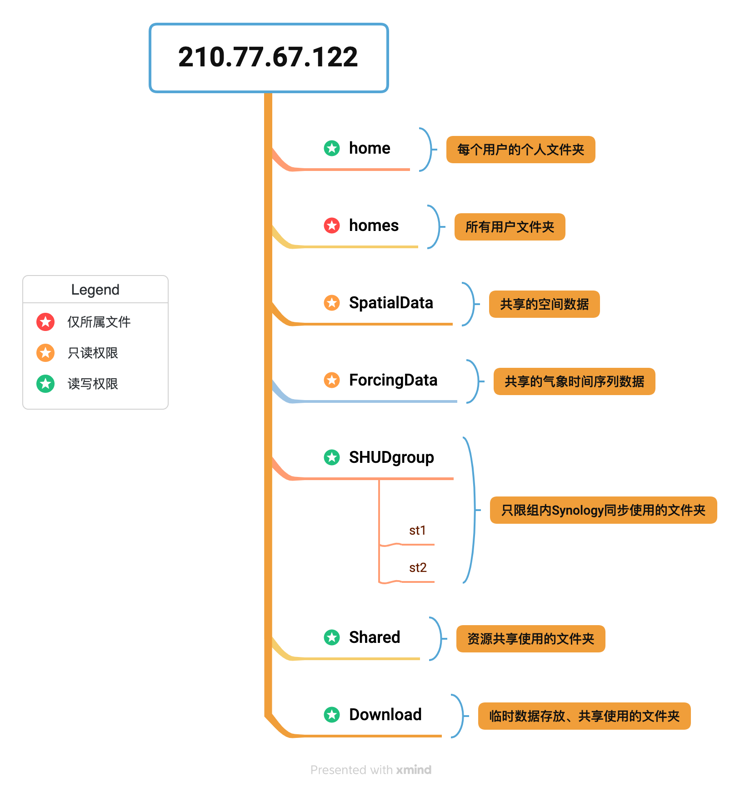
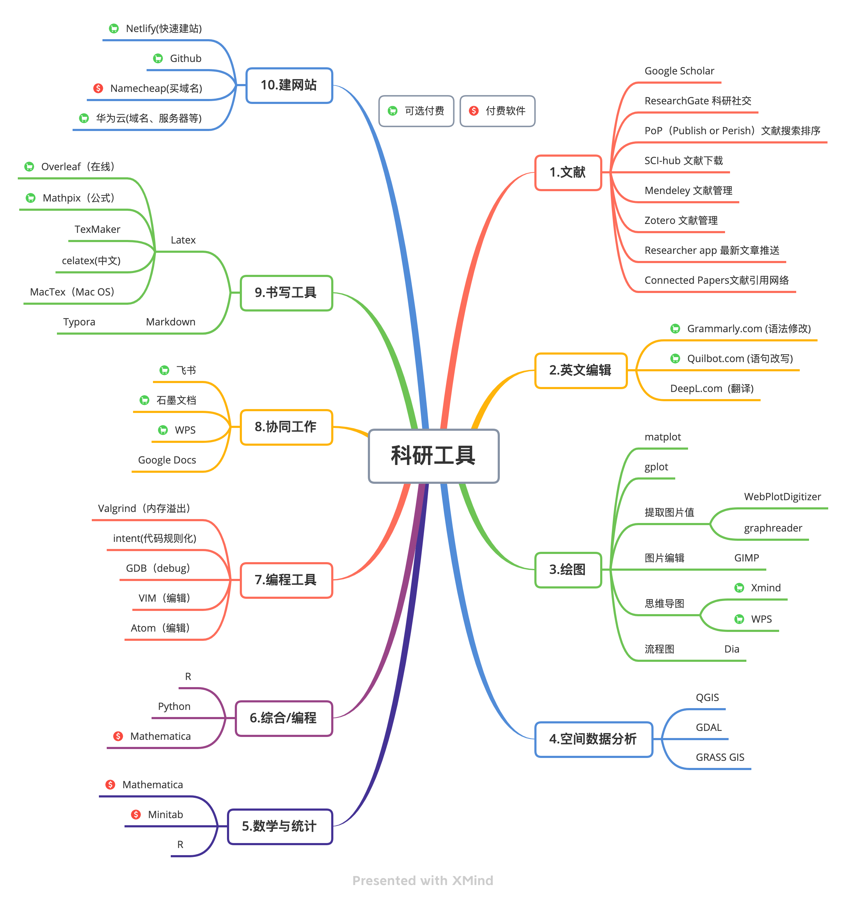

# 科研资源 {#res}

## 工作环境

## 网络存储

### 基本资源
本组建设有100TB的网络存储空间，供本组成员和合作者使用。

Synology Drive是依托本组的NAS网络存储建设的，可以远程以网络磁盘的方式访问，也可以使用sftp, Synology Drive， rsync等方式访问。

### 账号开通/注销

- **账号开通**

    - 在加入本组后，向PI报告你的邮箱；由PI给你开通账号，并告知用户名和密码。
    - 账号的权限等级由个人身份决定，不同权限对NAS的读写权限略有不同。
    - 账号开通后，你会收到一封邮件，邮件包含了NAS服务的访问地址。请在收到邮件后登录NAS页面，并修改秘密。 
    
- **账号注销**

    - 成员离开本组后，账号会继续保留至少一年。
    - 你可以在一年内，备份个人网盘内的数据。一年后，你的账号将被删除，无法再访问NAS系统。

### NAS文件结构

当前的NAS文件结构与读写权限见下图：

更具体的信息见下表：

| 文件夹 | 学生权限 | 合作者权限 | 容量  | **注意事项** |
|:---:|:---:|:---:|:---:|:---:|
| homes | 无 | 无 | 无限 | 所有用户文件都存放于此，普通用户无法访问  |
| home | 读写  | 读写 | 10TB | 用户个人主目录，其他用户无法访问 |
| SpatialData | 只读 | 只读  | 10TB | 仅特定用户有权更新 |
| ForcingData | 只读 | 只读  |  10TB | 仅特定用户有权更新  |
| SHUDgroup | 读写 | 读写 | 10TB | 组内成员间自动同步。勿随意存放文件 |
| Shared | 读写 | 读写 | 10TB  | 共享资源 |
| Download | 读写 | 读写 | 无限 | 文件临时存放。所有人可写，勿长期存放重要文件 |

### 访问NAS

- 用户名：shuder
- 密码: xxxxx
- NAS访问地址： [https://shudxyz.direct.quickconnect.to:5318](https://shudxyz.direct.quickconnect.to:5318)

### NAS 作为网络磁盘
- Mac OS
    - 打开Finder（访达），然后使用键盘CMD+k，访问网络地址。
    - 在打开的窗口中输入：afp://210.77.67.122。然后点击连接（Connect）
    - 然后提示框要求输入用户名和密码。
    - 选择你需要加载的磁盘。
    
- Windows

### 云盘Synology Drive {#synology}

这应该是进入本组第一个学会的软件。软件的安装使用都非常简单，但是你需要学会的是重新思考**如何组织自己的文件？如何高效的定位自己的文件？**

加入本组的工作全部在Synology Drive上进行备份。 文件备份在NAS云端，任何地点任何电脑上都可以查看/编辑你云盘里面的文件，不会出现*“电脑坏了，文件丢失”*，*“文件染病毒打不开”*，*“电脑忘记带了，没法交作业”*的情况。

## 超算

## 图书借阅

## 文献下载

## 科研工具

推荐使用的科研软件请先查看下面这张图。绝大部分为免费软件，个别是收费软件。

### QGIS
QGIS是开源、免费的空间数据软件，工作非常高效。

下载地址：[https://www.qgis.org/en/site/forusers/download.html](https://www.qgis.org/en/site/forusers/download.html)

### XMind
思维导图软件。

下载地址：[https://xmind.cn/download/](https://xmind.cn/download/)

### Mendeley Desktop

文献管理软件

下载地址：[https://www.mendeley.com/download-reference-manager](https://www.mendeley.com/download-reference-manager)

